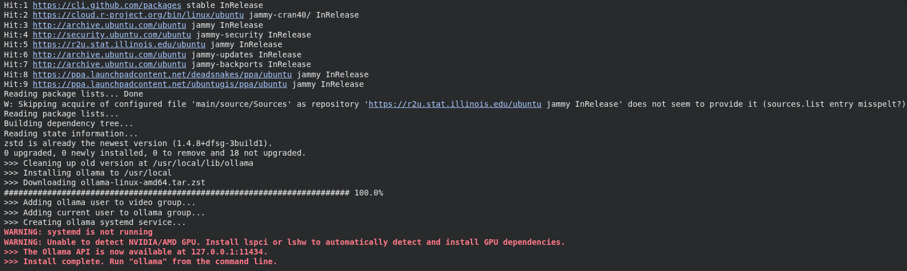
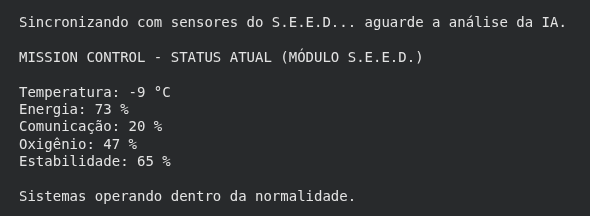
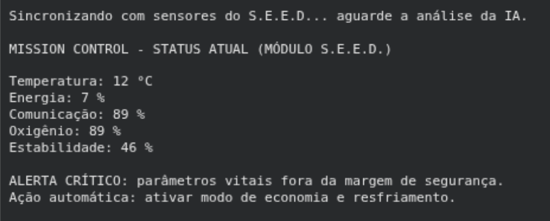
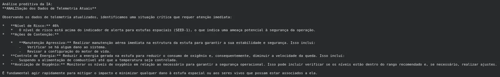

# S.E.E.D. — Sistema Espacial de Estufa Digital

**Mission Control AI — Global Solution 2026.1 (Prompt and Artificial Intelligence — FIAP)**

## Integrantes
- Gabriel Martins Cordeiro Rodrigues — RM: 570497
- Gustavo Fondato de Souza — RM: 573651
- Gustavo Martins Da Silva — RM: 570584

## Sobre o projeto
Sistema de monitoramento de uma missão espacial experimental, feito em Python e executado no Google Colab. O notebook gera dados simulados de telemetria de uma estufa espacial (temperatura, energia, comunicação, oxigênio e estabilidade), aciona um alerta automático quando algum parâmetro sai da margem de segurança e usa o modelo Llama 3.2 (via Ollama) para avaliar o risco e sugerir ações de contingência.

## Tecnologias
- Python 3 (Google Colab)
- Ollama
- Modelo Llama 3.2 (1B)
- Biblioteca `ollama`

## Como executar
Abra o notebook no Google Colab:

[Acessar Notebook](COLE_AQUI_O_LINK_DO_COLAB)

Execute as células em ordem. A primeira célula instala o Ollama e baixa o modelo Llama automaticamente. A célula final sorteia uma nova leitura de sensores e exibe a análise da IA — rode novamente para ver outros cenários (normal e crítico).

## Demonstração
> Substitua pelas imagens reais. Salve os prints na pasta `assets/` e mantenha os nomes abaixo (ou ajuste as referências).

Setup concluído (Ollama + modelo instalados):

Status NORMAL:

Status CRÍTICO com alerta automático:

Análise preditiva gerada pela IA:

## Vídeo de demonstração
[Assistir ao vídeo](COLE_AQUI_O_LINK_DO_VIDEO)
